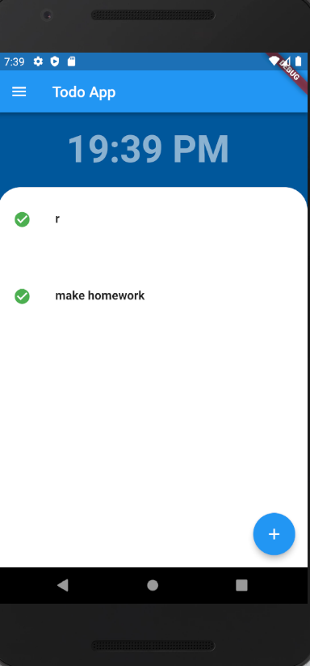

<h1>Flutter Todo List App</h1>

This is a sample todo list app developed with Flutter. The purpose of this project is to learn how to work with different state management solutions and understand their strengths and weaknesses.

<h2>Features</h2>

<ul><li>Add, edit and delete tasks</li><li>Mark tasks as complete</li><li>Filter tasks by status (all, completed, active)</li><li>Dark and light themes</li></ul>

<h2>State management</h2>

In this project, we use the following state management solutions:

<ul><li><a href="https://bloclibrary.dev/" target="_new">BLoC</a></li><li><a href="https://mobx.netlify.app/" target="_new">MobX</a></li><li><a href="https://pub.dev/packages/provider" target="_new">Provider</a></li><li><a href="https://redux.js.org/" target="_new">Redux</a></li><li><a href="https://riverpod.dev/" target="_new">Riverpod</a></li><li><a href="https://pub.dev/packages/scoped_model" target="_new">Scoped Model</a></li></ul>

## Screenshots

<h2>Getting started</h2>
<ol><li>Install <a href="https://flutter.dev/docs/get-started/install" target="_new">Flutter</a>.</li><li>Clone this repository.</li><li>Install dependencies by running <code>flutter pub get</code>.</li><li>Run the app using <code>flutter run</code>.</li></ol>

<h2>Contributing</h2>

Contributions are welcome! If you find any issues or have suggestions, please open an issue or a pull request.

<h2>License</h2>

This project is licensed under the MIT License. See the <a href="LICENSE" target="_new">LICENSE</a> file for more details.

